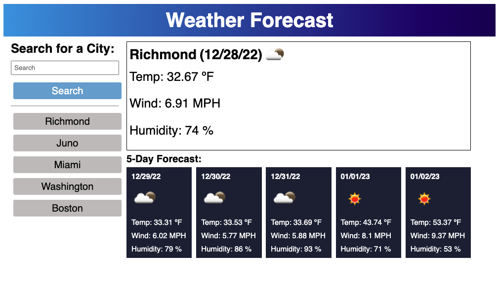

# Weather Forecast

## Description
This app uses Open Weather Map's API to display the current weather and also the five day forecast. User's can submit a city through the form or click a previous search below. When a city is selected the API fetches coordinates that are used to return weather data. Day.js is also used to set specific date information.

## User Interface
The user interface utilizes the view port to set elements sizes dynamically. There's also a breakpoint in the CSS file so that the web app is mobile friendly.

## Link
[Weather Forecast](https://jakeroth0.github.io/weatherForecast/)

## Credits
Open Weather Maps
Day.js

## License
N/A

## Screen Shot

